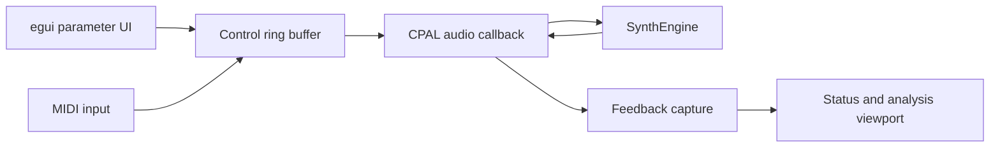

# Application: Development Harness

`synth-app` is the desktop development harness for the synthesizer. It is for
auditioning patches, testing MIDI behavior, selecting devices, and watching
real-time analysis while the engine evolves. It is deliberately not positioned
as the end-user product or a reusable host SDK.

The application uses `eframe` and `egui` for its UI, CPAL for real-time audio,
and `midir` for MIDI input. It saves patch and settings state between runs and
shows live voice and timing status. A detached analysis viewport receives audio
feedback from the callback for spectrum and signal inspection.

## Main views

- **Parameters** edits the sound: oscillators, filter, envelopes, LFOs,
  modulation, effects, and master volume.
- **Settings** selects MIDI, output and optional input devices, sample rate,
  filter oversampling, and theme-related preferences.

The application lists available audio devices on startup. It chooses a named
device when supplied, otherwise the system default. An optional input can be
opened at the output sample rate and summed into the synth output. Device and
sample-rate changes take effect on the next launch.

## Threading model

The user interface and MIDI callbacks do not manipulate the sound engine
directly. They write control events into a bounded `rtrb` ring buffer. The
CPAL audio callback drains those events, renders audio, and sends lightweight
feedback to the UI and analysis view.



## Running it

```bash
cargo run --release -p synth-app
```

Optional positional device filters are MIDI port, output device, then input
device:

```bash
cargo run --release -p synth-app -- "MIDI Port Name" "Output Device Name" "Input Device Name"
```
