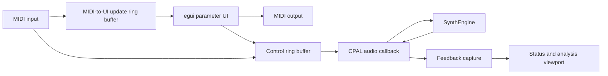

# Application: Development Harness

`synth-app` is the desktop development harness for the synthesizer. It is for
auditioning patches, testing MIDI behavior, selecting devices, and watching
real-time analysis while the engine evolves. It is deliberately not positioned
as the end-user product or a reusable host SDK.

The application uses `eframe` and `egui` for its UI, CPAL for real-time audio,
and `midir` for MIDI input and output. It saves patch and settings state between runs and
shows live voice and timing status. A detached analysis viewport receives audio
feedback from the callback for spectrum and signal inspection.

## Main views

- **Parameters** edits the sound: oscillators, filter, envelopes, LFOs,
  modulation, effects, and master volume.
- **Settings** selects MIDI input/output, audio output and optional audio input
  devices, sample rate, filter oversampling, and theme-related preferences.

The application lists available audio devices on startup. It chooses a named
device when supplied, otherwise the system default. An optional input can be
opened at the output sample rate and summed into the synth output. Changing
the output device, input device, or sample rate in Settings and clicking
**Apply audio changes** rebuilds the CPAL streams at runtime (with a brief
interruption). The current patch parameters are reloaded after a successful
apply.

## Threading model

The user interface and MIDI callbacks do not manipulate the sound engine
directly. They write control events into a bounded `rtrb` ring buffer. The
CPAL audio callback drains those events, renders audio, and sends lightweight
feedback to the UI and analysis view. Parameter changes decoded from MIDI are
also copied into a second bounded queue. The UI drains that queue once per
frame to mirror the same value in its controls without sending it back to the
engine a second time.



## Rev2 MIDI parameters

The app accepts both the Continuous Controller and NRPN assignments from
Appendix E of the Prophet Rev2 User's Guide. CC mappings cover the guide's
limited controller set; NRPN is the complete path for every corresponding
parameter implemented by this synth. Rev2 raw values are translated into the
app's existing units, such as hertz and seconds.

NRPN selection and Data Entry state is tracked independently for each MIDI
channel. Data Increment, Data Decrement, and the null RPN reset are supported.
Program Edit Buffer SysEx dumps are decoded into the shared `Patch` type. The
app imports Layer A, including key mode, unison, and Glide enable, mode, and
per-oscillator rates. Layer B, sequencer, arpeggiator, and global settings are
ignored because the app does not currently implement those Rev2 systems. Rev2
chord voicings cannot be imported because their program-image
bytes are not documented; native patches preserve chord memory.

Stored Program Data dumps are library imports rather than live edits. The app
reads their bank and program metadata, decodes Layer A, and saves the patch as
pretty JSON without changing the active engine or UI. Rev2 factory sysex banks 0-3
save as F1-F4; Rev2 device banks 4-7 save as U1-U4. Prophet '08 factory banks
save as F5-F6. Imported programs use the embedded Layer A name from each program.
Filenames are sortable, such as `F1-001-LosVangelis2041.json`; receiving the same
location again overwrites the same file.

Whole patch loads and initial device synchronization use one Rev2 Program Edit
Buffer SysEx message. Layer A contains the local patch, Layer B contains the
local default patch, and unsupported raw fields are zero. Live UI edits remain
Rev2 NRPN messages on channel 1. Repeated values that quantize to the same Rev2
value are suppressed. Parameter changes and patches received from MIDI update
the local engine and UI without being copied to MIDI output, preventing
feedback loops. The desktop and Daisy firmware use the same codec, so their
parameter numbers and value scaling remain identical.

The **Send** button beside the program **Save** button retransmits the current UI patch as a full
Program Edit Buffer without changing local state. Use it to resynchronize after
the connected hardware restarts or otherwise loses its edit buffer. If the
previous output connection became stale, the action reconnects to the selected
output and retries once.

## Running it

```bash
cargo run --release -p synth-app
```

Optional positional device filters are MIDI port, output device, then input
device:

```bash
cargo run --release -p synth-app -- "MIDI Port Name" "Output Device Name" "Input Device Name"
```
