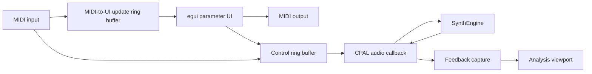

# Application: Development Harness

`synth-app` is the desktop development harness for the synthesizer. It is for
auditioning patches, testing MIDI behavior, selecting devices, and watching
real-time analysis while the engine evolves. It is deliberately not positioned
as the end-user product or a reusable host SDK.

The application uses `eframe` and `egui` for its UI, CPAL for real-time audio,
and `midir` for MIDI input and output. It saves patch and settings state between
runs and shows live voice and timing status.

## Main views

- **Parameters** is the sound-design view: oscillators, filter, envelopes, LFOs,
  modulation, effects, and master volume. Use it to audition and shape patches
  while the engine is running. It also exposes layer mode (Normal, Stack, or
  Split) and sequencer transport shared with the Sequencer view. Open
  **Analysis** from here when you need live spectrum or scope feedback.
- **Sequencer** is for writing and playing the four-track gated and six-lane
  polyphonic sequencers. Use it for step entry, recording, transport, and
  clearing patterns. Musical states such as tie, rest, and reset are editable
  without losing the underlying Rev2 note and velocity bytes.
- **Settings** configures how the harness talks to the outside world: MIDI,
  audio devices, sample rate, and host preferences. Start here when wiring
  controllers, a Rev2-compatible device, or comparing hardware audio against
  the software engine.
- **Analysis** is a detached viewport for spectrum and signal inspection (see
  below). Its open state and geometry are restored between runs.

## Settings

Settings covers MIDI ports, MIDI clock, audio I/O, sample rate, filter
oversampling, and theme. Audio device and sample-rate changes apply at runtime
with a brief interruption; the current patch is reloaded afterward. An optional
input can be opened at the output sample rate and summed into the synth output,
or used only for Analysis comparison.

**MIDI Clock** can be Off, Slave, or Master. Master sends Timing Clock on the
selected MIDI output at 24 pulses per quarter note. Slave takes tempo from the
MIDI input marked as the clock source and shows the live effective BPM in
Parameters without overwriting the patch's local BPM; Off or Master restores
that editable local value.

**MIDI Output Clock** configures a connected Rev2-compatible device through
global NRPN 4099. Off, Slave, and Slave No S/S are active; Master and Slave
Thru are future work and disabled for Daisy. Realtime messages can be used
locally, forwarded, or both. In harness Master mode, incoming realtime clock
is not forwarded, so a second clock stream cannot compete with the generated
one. The desired output mode and patch are replayed after output reconnection.

## Threading model

The user interface and MIDI callbacks do not manipulate the sound engine
directly. They write control events into a bounded `rtrb` ring buffer. The
CPAL audio callback drains those events, renders audio, and sends lightweight
feedback to the UI and analysis view. Parameter changes decoded from MIDI are
also copied into a second bounded queue. The UI drains that queue once per
frame to mirror the same value in its controls without sending it back to the
engine a second time.



## Analysis window

Open the window with the **Analysis** button in the Parameters view. It is a
detached egui viewport with three tabs. Only **Real Time** consumes live audio
from the engine; the design tabs render offline probes used while developing
DSP.

### Real Time

The audio callback publishes synchronized stereo blocks of synth output and,
when an input device is open in Settings, the captured input. The Real Time tab
drains those blocks and shows an oscilloscope and a spectrum analyzer.

Both plots share a **Signal** selector:

| Button | Source |
|---|---|
| **I** | Audio input only |
| **O** | Synth output only |
| **I+O** | Both overlaid (input in warm colors, output in cool colors) |

Use this to compare hardware against the software reference: route the
hardware's audio into the selected input device, play the same patch (or MIDI)
on both, and switch **I** / **O** / **I+O** to inspect each signal alone or
together in time and frequency. Input capture for analysis does not require
**Audio In** mixing into the speakers; that toggle only sums input into the
audible output.

Oscilloscope controls cover trigger mode (Free / Auto / Normal / Single),
timebase, trigger level and slope, acquisition length, vertical range, and
left / right / stereo traces. The spectrum analyzer offers FFT size, window type,
linear or log frequency axis, optional peak hold, and left / right / sum
channel selection. Hover readouts report frequency, level, and nearest note.

### Osc Design

Offline oscillator workbench. It renders a chosen waveform (saw, saw+tri,
triangle, or pulse) with PolyBLEP or BLEP anti-aliasing, shape amount, MIDI
note, sample rate, and cycle count. The view shows the time-domain waveform
(zoom and pan) and its spectrum, with optional harmonic markers. **Live**
re-renders while controls change; **Render** forces a pass; **Save WAV**
exports the current buffer. This tab does not play through the main engine.

### Filter Design

Offline filter frequency-response probe. Choose filter model, cutoff,
resonance, poles, sample rate, and oversampling. The plot shows magnitude in
dB; optional smoothing and **Overlay all models** compare every model at the
current settings while only the selected model drives the live synth.
Selecting a model updates the engine filter type. **Live** refreshes as
parameters change; **Refresh** forces a new measurement. Self-oscillating
resonances use a sine-probe measurement instead of a small impulse.

## Rev2 MIDI parameters

The app accepts both the Continuous Controller and NRPN assignments from
Appendix E of the Prophet Rev2 User's Guide. CC mappings cover the guide's
limited controller set; NRPN is the complete path for every corresponding
parameter implemented by this synth. Rev2 raw values are translated into the
app's existing units, such as hertz and seconds.

NRPN selection and Data Entry state is tracked independently for each MIDI
channel. Data Increment, Data Decrement, and the null RPN reset are supported.
Program Edit Buffer SysEx dumps are decoded into the shared `Patch` type. The
app imports both layers independently, including names, key mode, unison,
arpeggiator, Glide, effects, modulation, both sequencers, mode, split point, and
per-oscillator rates. Global device settings remain unsupported. Rev2 chord voicings
cannot be imported because their program-image bytes are not documented;
native patches preserve chord memory.

### Importing factory presets

Stored Program Data dumps are library imports rather than live edits. There is
no file-open dialog: send a Sequential `.syx` file to a MIDI input port
selected in Settings (with the **Patches** toggle enabled) through a virtual
port or loopback. Download the official banks from Sequential's
[Prophet Rev2 sounds](https://sequential.com/support/download/prophet-rev2-sounds/)
page.

The app accepts both formats:

| Source | SysEx framing | Saved as |
|---|---|---|
| Prophet Rev2 factory banks | `F0 01 2F 02 … F7` (banks 0–3) | **F1–F4** |
| Prophet Rev2 user banks | `F0 01 2F 02 … F7` (banks 4–7) | **U1–U4** |
| Prophet '08 sound bank | `F0 01 23 02 … F7` (banks 0–1) | **F5–F6** |

Rev2 factory programs therefore land under F1–F4; Prophet '08 programs under
F5 and F6. Each message is decoded as a complete two-layer program and written
as versioned pretty JSON without changing the active engine or UI. Filenames use the bank label, a
1-based program number, and the embedded Layer A name — for example
`F1-001-LosVangelis2041.json` or `F5-001-Wagnerian.json`. Receiving the same
bank and program again overwrites that file.

Native files use schema version 1 and contain `mode`, `split_point`, and
`layers.a` / `layers.b`. Older raw single-`LayerPatch` JSON files are not
accepted; re-import their source programs instead.

Imported patches are saved alongside user-saved patches:

| OS | Location |
|---|---|
| macOS | `~/Library/Application Support/noctum/patches/` |
| Linux | `~/.local/share/noctum/patches/` |
| Windows | `C:\Users\<user>\AppData\Roaming\noctum\patches\` |

If the MIDI program import queue fills up, a message is printed to the console.
Send SysEx at a reasonable speed. Hardware program memory accepts both Rev2 and
Prophet '08 Program Data; see [Factory Presets](appendix/factory-presets.md).

Whole patch loads and initial device synchronization use one Rev2 Program Edit
Buffer SysEx message. The layer bar selects Normal, Stack, or Split playback,
the split point, and which layer the controls edit. Normal gives the selected
layer all 16 voices; Stack and Split render both layers with eight voices each.
Unsupported raw fields are zero. Live UI edits use Layer A NRPNs or the
documented `+2048` Layer B numbers on channel 1, with NRPN 4190 selecting the
edit layer. Layer Mode and Split Point use program-global NRPN 163 and 171
(CC 18 and 39 also accepted on input). Sequencer Play/Stop and Record use
transient NRPN 180 and 181. Repeated values that quantize to the same Rev2
value are suppressed.
Parameter changes and patches received from MIDI update the local engine and UI
without being copied to MIDI output, preventing feedback loops. The desktop and
Daisy firmware use the same codec, so their parameter numbers and value scaling
remain identical.

The **Send** button beside the program **Save** button retransmits the current UI patch as a full
Program Edit Buffer without changing local state. Use it to resynchronize after
the connected hardware restarts or otherwise loses its edit buffer. If the
previous output connection became stale, the action reconnects to the selected
output and retries once.

## Running it

```bash
cargo run --release -p synth-app
```

Pick devices in Settings after launch. Positional CLI filters (MIDI port, then
output and input device names) still work for scripting but are not the usual
path.
