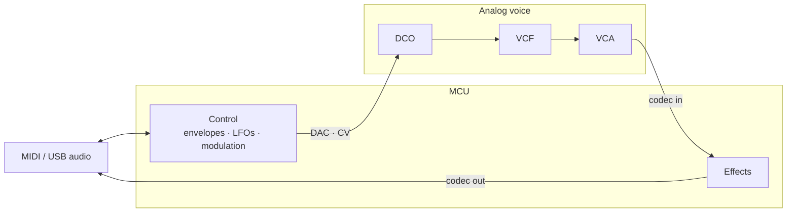

# Pro Analog (Far Roadmap)

A hybrid instrument: digital control and effects on a microcontroller, with the
core voice path in real analog hardware.

The MCU runs the familiar Noctum control plane — MIDI, envelopes, LFOs,
modulation routing, patch storage, and global effects — while pitch, filter,
and amplitude are produced by analog components driven over CV. Platform, voice
count, and physical I/O are not yet determined.

## Signal path

Host MIDI and USB audio talk to the MCU. Control voltages leave through DACs
into the analog voice chain; the mixed analog audio returns through a codec so
the MCU can apply digital effects before the final output.

Control, timing, and modulation stay digital and precise. Tone generation and
filtering stay analog. Effects close the loop in the digital domain after the
analog path, so delay, reverb, and similar processing do not need an all-analog
implementation.
