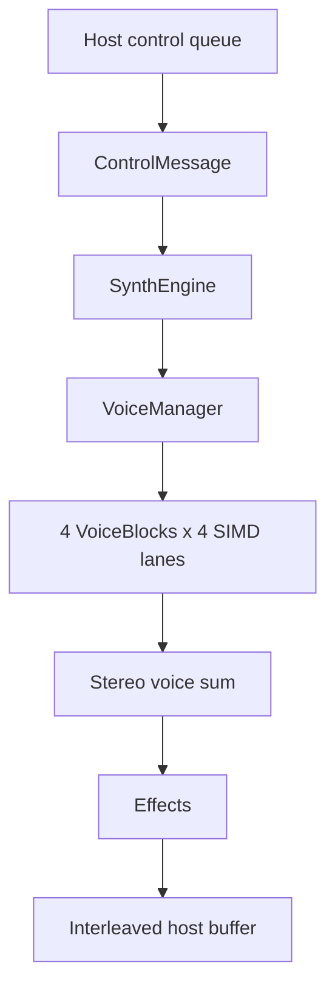
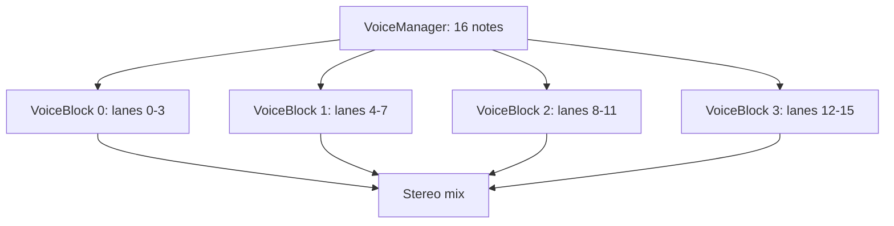

# SDK: Engine Architecture

This page describes implementation ownership and data flow. It is intentionally
separate from the Synthesizer guide, where the same signal path is explained in
musical terms.

`SynthEngine` owns the voice manager, global effects, and master volume. It
accepts `ControlMessage` values, fans shared patch updates out to active voice
blocks, sums stereo voice output, processes the selected effect, applies master
gain, and clamps the final samples.

## Voice layout

The engine has 16 voices. They are implemented as four `VoiceBlock` instances,
each operating on four `wide::f32x4` lanes. A lane carries its own note,
velocity, gate, envelopes, LFO outputs, and filter state. Patch parameters are
shared across the lanes in a block.

## Portability boundary

The core library does not depend on `std`, CPAL, egui, MIDI enumeration, or
desktop configuration. `synth-app` owns those concerns. This boundary is the
reason hosts can use the same control protocol and DSP engine across different
software runtimes, and it is the intended starting point for future hardware
work.
