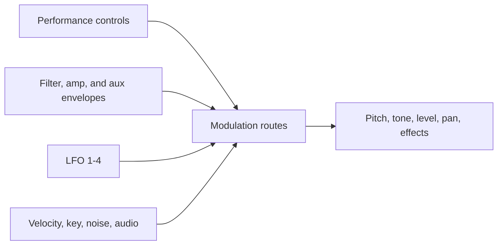

# Modulation and Effects

Modulation turns a static patch into a responsive instrument. A route takes one
source, applies an amount, and sends it to one destination. Sources include
performance gestures, envelopes, LFOs, note number, velocity, noise, and the
audio signal itself.

## Routes and destinations

There are eight free routes. Each one chooses its source, destination, amount,
and enabled state. Five additional routes are dedicated to common performance
sources: mod wheel, pressure, breath, velocity, and MIDI footswitch. Dedicated
routes let you choose the destination and amount without first choosing a
source.

Routes can control oscillator pitch, shape, level, mix, sub level, noise,
slop, filter cutoff and resonance, audio modulation, amplifier level, pan, LFO
rate and depth, envelope stages and amounts, other route amounts, and effect
controls.

Good starting patches include a slow LFO to cutoff for motion, velocity to
filter envelope amount for expressive playing, or the auxiliary envelope to
oscillator pitch for a short sweep. Use small amounts first: several subtle
routes usually produce more useful motion than one extreme route.

## Pitch modulation: LFO destination vs mod matrix

When you modulate oscillator frequency, the synth does **not** treat every
path the same way. That matches Prophet Rev2 behavior measured on the
[Sequential forum](https://forum.sequential.com/index.php?topic=3203.0).

There are two musical scales:

1. **LFO Amount → Osc Freq** (the LFO’s own destination knob). A little amount
   goes a short distance; amount **96** is one octave of vibrato or sweep at
   full LFO swing.
2. **Mod matrix / Env 3 / aux envelope → Osc Freq**. The same numeric
   “amount” moves pitch farther. Amount **24** is one octave; full amount is
   roughly five octaves either side. Use small values for vibrato-like
   motion.

Rule of thumb: **LFO Amount 4 ≈ matrix Amount 1** when both target oscillator
frequency.

| What you turn | Amount for 1 semitone | Amount for 1 octave |
| --- | ---: | ---: |
| LFO Amount (LFO dest = Osc Freq) | 8 | 96 |
| Mod matrix or Env 3 / aux → Osc Freq | 2 | 24 |

**Why this matters when patching**

- A dedicated LFO to Osc Freq is the gentle path: good for vibrato and slow
  pitch motion without huge detuning.
- Routing an LFO *through* the matrix (source = LFO, dest = Osc Freq) uses the
  **matrix** scale, not the LFO-destination scale. The LFO Amount still
  scales the waveform; the matrix Amount sets how far that waveform can push
  pitch.
- Env 3 / the auxiliary envelope to Osc Freq uses the matrix scale. Full
  positive amount is a very large pitch jump; for a one-octave blip, use
  about **24**.
- Note Number to Osc Freq also uses the matrix scale. Stacked matrix amounts
  totaling about **256** approximate the Osc Key Tracking switch; Note Number
  to Cutoff with amount about **128** approximates Filter Key Amount **64**.

Gated sequencer steps to Osc Freq stay at **half a semitone per raw step**,
independent of those amount tables.

Related filter calibration (cutoff ticks, key tracking, audio mod) is
summarized in [Rev2 control calibrations](../appendix/rev2-calibrations.md).

## Effects

Effects process the complete stereo voice mix, after polyphony and panning. One
global effect is active at a time, with enable, type, mix, clock sync, and two
effect-specific parameters.

| Effect | Character |
| --- | --- |
| Delay Mono | A centered echo made from the summed stereo input. |
| DDL Stereo | Clean stereo digital delay. |
| Bucket-Brigade Delay | Darker, smoothed delay character. |
| Chorus | Stereo pitch and time movement. |
| Phaser High / Low / Mst | Three phaser characters. |
| Flanger 1 / 2 | Two flanger variants. |
| Reverb | Compact multi-delay ambience. |
| Ring Mod | Metallic ring modulation, with optional low-note tracking. |
| Distortion | Soft clipping with tone filtering. |
| HP Filter | Stereo high-pass post-processing. |

Effect Mix blends dry and processed signal. The two generic effect parameters
have a different meaning for each algorithm. Delay-style effects can use clock
sync; other algorithms interpret their two parameters directly. Modulation
routes can also move effect mix and both effect parameters.
