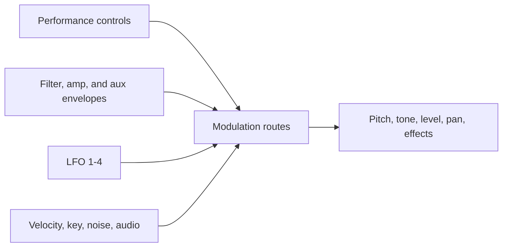

# Modulation and Effects

Modulation turns a static patch into a responsive instrument. A route takes one
source, applies an amount, and sends it to one destination. Sources include
performance gestures, envelopes, LFOs, note number, velocity, noise, and the
audio signal itself.

## Routes and destinations

There are eight free routes. Each one chooses its source, destination, amount,
and enabled state. Five additional routes are dedicated to common performance
sources: mod wheel, pressure, breath, velocity, and MIDI footswitch. Dedicated
routes let you choose the destination and amount without first choosing a
source.

Routes can control oscillator pitch, shape, level, mix, sub level, noise,
slop, filter cutoff and resonance, audio modulation, amplifier level, pan, LFO
rate and depth, envelope stages and amounts, other route amounts, and effect
controls.

Good starting patches include a slow LFO to cutoff for motion, velocity to
filter envelope amount for expressive playing, or the auxiliary envelope to
oscillator pitch for a short sweep. Use small amounts first: several subtle
routes usually produce more useful motion than one extreme route.

## Effects

Effects process the complete stereo voice mix, after polyphony and panning. One
global effect is active at a time, with enable, type, mix, clock sync, and two
effect-specific parameters.

| Effect | Character |
| --- | --- |
| Delay Mono | A centered echo made from the summed stereo input. |
| DDL Stereo | Clean stereo digital delay. |
| BBD Delay | Darker, smoothed delay character. |
| Chorus | Stereo pitch and time movement. |
| Phaser High / Low / Mst | Three phaser characters. |
| Flanger 1 / 2 | Two flanger variants. |
| Reverb | Compact multi-delay ambience. |
| Ring Mod | Metallic ring modulation, with optional low-note tracking. |
| Distortion | Soft clipping with tone filtering. |
| HP Filter | Stereo high-pass post-processing. |

Effect Mix blends dry and processed signal. The two generic effect parameters
have a different meaning for each algorithm. Delay-style effects can use clock
sync; other algorithms interpret their two parameters directly. Modulation
routes can also move effect mix and both effect parameters.
