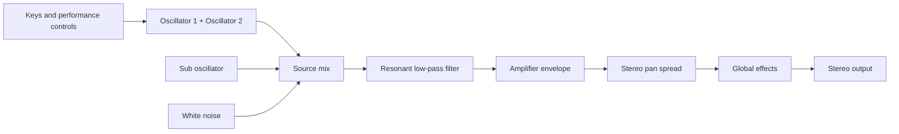

# Sound Architecture

Every voice follows the same subtractive signal path. The oscillators and noise
make a harmonically rich source; the filter removes or emphasizes harmonics;
the amplifier envelope shapes the note over time; and pan spread places voices
in the stereo field. The global effect is applied only after all active voices
have been mixed.

## Tone sources

Each voice has two main oscillators. Both can use saw, saw/triangle morph,
triangle, or pulse shapes. Tune them together for a focused sound, offset them
slightly for width and movement, or use oscillator 2 as the slave in a hard-sync
lead. Shape changes the character of the selected waveform.

The sub oscillator adds low-frequency weight. White noise can add breath,
percussion, or texture. Oscillator mix balances the two primary oscillators;
the sub and noise levels are independent additions.

Glide moves each pitched oscillator from the previously played note to its new
target. Fixed Rate uses a constant pitch rate, so wider intervals take longer;
Fixed Time gives every interval the same duration. The Auto variants apply the
same behavior only to overlapping, legato key presses. Note reset controls
whether a new note begins at a repeatable oscillator phase. Keyboard tracking
keeps pitch following the played key, while slop introduces subtle analog-style
drift.

The hardware guides do not publish the timing curve. This implementation maps
values 1–127 logarithmically from approximately 1 ms to 16 seconds; value 0
bypasses Glide. The curve is isolated so measured Rev2 timings can replace it
without changing patch or MIDI behavior.

## Filter and amplifier

The ladder low-pass filter offers a gentler 2-pole slope and a steeper 4-pole
slope. Cutoff sets brightness; resonance emphasizes frequencies around the
cutoff and can become self-oscillating at high settings. Keyboard tracking
opens the filter on higher notes. Cutoff modulation is additive in Prophet
semitone ticks: filter envelope amount ±127 opens or closes by that many
semitones at envelope peak, audio mod spans one octave at full depth, and
mod-matrix / LFO routes to cutoff use the same ±127-tick scale.

The amplifier envelope determines a note's volume contour. Pan spread assigns
new voices alternately to each side, so a chord can occupy a wider stereo image
without duplicating the signal.

## Polyphony

The instrument has 16 voices. For a player, a voice is simply one independently
articulated note. Internally, the engine renders them in groups of four, but
that implementation detail does not change patch behavior or the 16-note limit.
